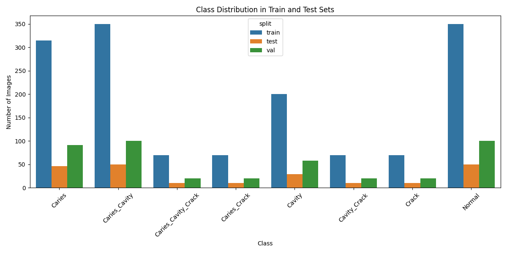
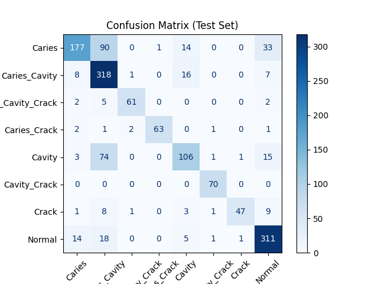
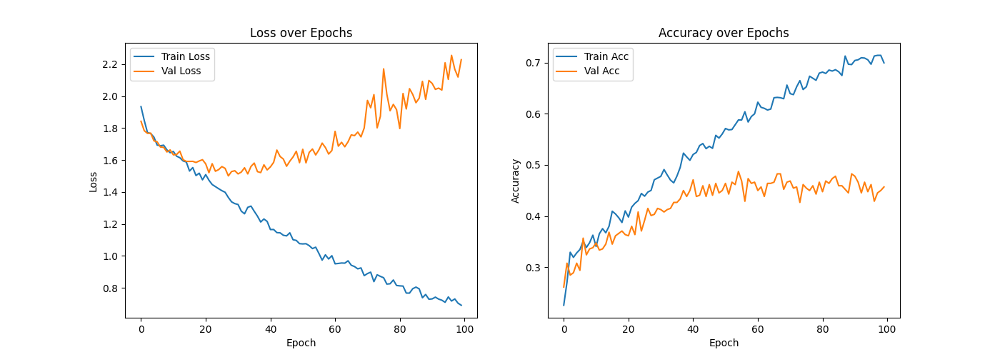

# Dental Image Classification MVP

This repository contains an end-to-end pipeline for dental image classification using deep learning. The project covers data preparation, model training, evaluation, ONNX export, and deployment via a FastAPI inference API. **This is a work in progress.**

---

## 📁 Directory Structure

```
Model/
  ├── best_model.pth         # Trained PyTorch model
  └── best_model.onnx        # Exported ONNX model

plots/
  ├── class_distribution_train_test.png
  ├── classification_report_test.txt
  ├── confusion_matrix_test.png
  └── training_curves.png

research/
  ├── 01-data_unzip.ipynb
  ├── 02-data_set.ipynb
  ├── 03.data_prep.ipynb
  ├── 04-data_labeling.ipynb
  ├── 05-data-training.ipynb
  └── 06-model-onnx.ipynb

Dentalapi.py                # FastAPI ONNX inference API
requirements.txt            # Python dependencies
instructions.txt            # Step-by-step usage guide
```

---

## 🚀 Quick Start

### 1. Installation

```bash
pip install -r requirements.txt
```

### 2. Running the API

```bash
uvicorn Dentalapi:app --reload
```
- The API will be available at [http://localhost:8000](http://localhost:8000)
- For interactive testing, open [http://localhost:8000/docs](http://localhost:8000/docs)
- Use the `/predict/` endpoint to upload a dental image and get the predicted class.

### 3. Viewing Plots & Reports

- All result plots are saved in the `plots/` directory.
- **Class Distribution:**  
  
- **Confusion Matrix:**  
  
- **Training Curves:**  
  
- **Classification Report:**  

```
Classification Report (Test Set):
                     precision    recall  f1-score   support

             Caries       0.86      0.56      0.68       315
      Caries_Cavity       0.62      0.91      0.74       350
Caries_Cavity_Crack       0.94      0.87      0.90        70
       Caries_Crack       0.98      0.90      0.94        70
             Cavity       0.74      0.53      0.62       200
       Cavity_Crack       0.95      1.00      0.97        70
              Crack       0.96      0.67      0.79        70
             Normal       0.82      0.89      0.85       350

           accuracy                           0.77      1495
          macro avg       0.86      0.79      0.81      1495
       weighted avg       0.80      0.77      0.77      1495
```
  

  See [`plots/classification_report_test.txt`](plots/classification_report_test.txt) for the full text report.

---
---

## 📦 Files Provided

- `Dentalapi.py`         : FastAPI script for ONNX model inference.
- `Model/best_model.onnx`: The trained ONNX model.
- `plots/`               : Folder containing result plots and reports.
- `requirements.txt`     : List of required Python packages.
- `instructions.txt`     : Step-by-step usage guide.
- `research/`            : Jupyter notebooks for data prep, training, and export.

---

## ⚠️ Status

**This project is currently a work in progress.**  
Expect improvements, refactoring, and more features in future updates.

---

## 📬 Contact

For questions, support, or collaboration, contact:

- **Email:** hrsmalik1798@gmail.com  
- **GitHub:** [hrsmalik1798](https://github.com/hrsmalik1798)

---

Enjoy!